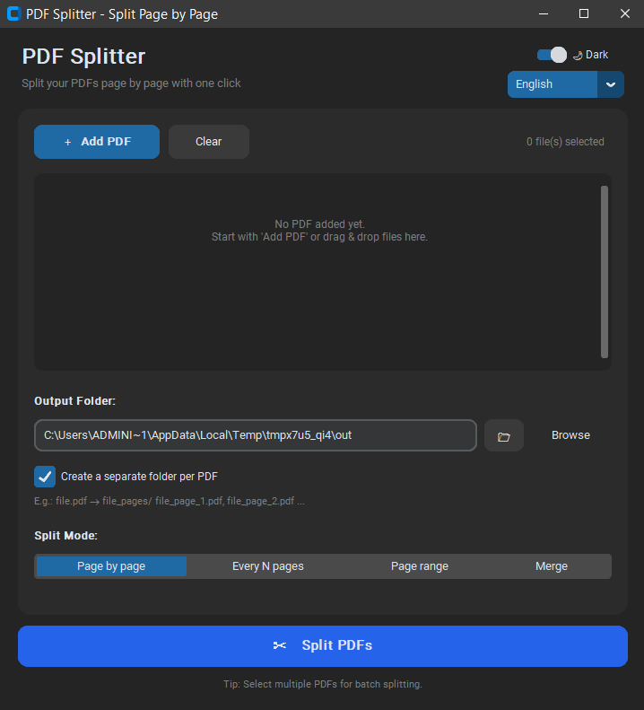

# PDF Splitter ✂️ | PDF Ayırıcı

<p align="center">
  <b>Split your PDFs page by page with one click.</b><br>
  Modern, fast and free desktop app.
</p>

<p align="center">
  
  
  
  
</p>

<p align="center">
  <a href="#-türkçe">🇹🇷 Türkçe için aşağıya kaydırın</a>
</p>

---

## ✨ Features

- 📄 **Page-by-page splitting** — `report.pdf` → `report_page_1.pdf`, `report_page_2.pdf`, ...
- 📦 **Batch processing** — Select multiple PDFs and split them in one go
- 📁 **Smart output** — Automatic `name_pages/` folder per PDF (optional)
- 👀 **Page preview** — See the page count as soon as you add files
- 📊 **Live progress** — Progress bar + status log
- 🧵 **Non-freezing UI** — Splitting runs in the background (threading)
- 🌙 **Dark / Light theme** — One-click switch in the top-right, choice is remembered
- 🌍 **5 languages** — Türkçe, English, Deutsch, Français, Español (top-right selector, choice is remembered)
- 🔒 **Encrypted-PDF safe** — Encrypted files are skipped, the app never crashes
- 🎨 **Modern UI** — Clean CustomTkinter interface

## 🖼️ Screenshot



```
PDF Splitter
├── ＋ Add PDF  |  Clear
├── 📋 PDF list (with page counts)
├── 📁 Output folder selection
├── ☑ Create a separate folder per PDF
└── ✂ Split PDFs
```

Example output:

```
Desktop/
└── report_pages/
    ├── report_page_1.pdf
    ├── report_page_2.pdf
    └── report_page_3.pdf
```

## 🚀 Installation

### 1. Run from source

```bash
git clone https://github.com/Kcguner/pdf-ayirici.git
cd pdf-ayirici

# (recommended) virtual environment
python -m venv venv
# Windows:
venv\Scripts\activate
# macOS/Linux:
source venv/bin/activate

pip install -r requirements.txt
python pdf_ayirici.py
```

### 2. Requirements

```
pypdf>=5.0
customtkinter>=5.2.0
```

Python **3.10+** recommended. Tkinter ships with most Python installations.

### 3. Use as EXE (Windows)

`PDF_Ayirici.spec` ships with the repo. Build the exe with one command:

```bash
pip install pyinstaller
pyinstaller PDF_Ayirici.spec
# Output: dist/PDF_Ayirici.exe
```

> Note: `build/` and `dist/` folders are not committed (excluded via `.gitignore`). Build the EXE yourself or download it from [Releases](../../releases).

## 📖 Usage

1. Press **Add PDF**, select one or more PDFs
2. Choose the **output folder** (default: Desktop)
3. Optionally keep **"Create a separate folder per PDF"** enabled
4. Press **Split PDFs** — done! 🎉

## 🛠️ Project Structure

```
pdf-ayirici/
├── pdf_ayirici.py      # Main app (CustomTkinter + pypdf)
├── requirements.txt    # Dependencies
├── PDF_Ayirici.spec    # PyInstaller config
├── .gitignore
├── LICENSE
└── README.md
```

## 🤝 Contributing

Contributions welcome! 🧡

1. Fork it
2. Create a branch (`git checkout -b feature/cool-thing`)
3. Commit (`git commit -m "Add cool thing"`)
4. Push (`git push origin feature/cool-thing`)
5. Open a Pull Request

Use [Issues](../../issues) for suggestions / bug reports.

Ideas:
- [ ] Drag & drop PDF adding
- [ ] Page-range selection (e.g. 1-5, 10-12)
- [ ] More languages

## 📝 License

Licensed under [MIT](LICENSE).

## ⭐ Support

If it helped you, leave a star — it motivates! ⭐

---
---

## 🇹🇷 Türkçe

<p align="center">
  <b>PDF'lerinizi tek tıkla sayfa sayfa ayırın.</b><br>
  Modern, hızlı ve ücretsiz masaüstü uygulaması.
</p>

## ✨ Özellikler

- 📄 **Sayfa sayfa bölme** — `rapor.pdf` → `rapor_sayfa_1.pdf`, `rapor_sayfa_2.pdf`, ...
- 📦 **Toplu işlem** — Birden fazla PDF seçip tek seferde ayırın
- 📁 **Akıllı çıktı** — Her PDF için otomatik `ad_sayfalar/` klasörü (isteğe bağlı)
- 👀 **Sayfa önizleme** — Listeye ekler eklemez sayfa sayısını görün
- 📊 **Canlı ilerleme** — Progress bar + durum logu
- 🧵 **Donmayan arayüz** — Ayırma işlemi arka planda (threading) çalışır
- 🌙 **Koyu / Açık tema** — Sağ üstteki anahtarla tek tıkla değişir, seçim hatırlanır
- 🌍 **5 dil desteği** — Türkçe, English, Deutsch, Français, Español (sağ üstten seçilir, seçim hatırlanır)
- 🔒 **Şifreli PDF koruması** — Şifreli dosyalar atlanır, program çökmez
- 🎨 **Modern UI** — CustomTkinter ile temiz arayüz

## 🖼️ Ekran Görüntüsü


```
PDF Ayırıcı
├── ＋ PDF Ekle  |  Temizle
├── 📋 PDF listesi (sayfa sayısı ile)
├── 📁 Çıkış klasörü seçimi
├── ☑ Her PDF için ayrı klasör oluştur
└── ✂ PDF'leri Ayır
```

Örnek çıktı yapısı:

```
Masaüstü/
└── rapor_sayfalar/
    ├── rapor_sayfa_1.pdf
    ├── rapor_sayfa_2.pdf
    └── rapor_sayfa_3.pdf
```

## 🚀 Kurulum

### 1. Kaynaktan çalıştırma

```bash
git clone https://github.com/Kcguner/pdf-ayirici.git
cd pdf-ayirici

# (önerilir) sanal ortam
python -m venv venv
# Windows:
venv\Scripts\activate
# macOS/Linux:
source venv/bin/activate

pip install -r requirements.txt
python pdf_ayirici.py
```

### 2. Gereksinimler

```
pypdf>=5.0
customtkinter>=5.2.0
```

Python **3.10+** önerilir. Tkinter çoğu Python kurulumuyla birlikte gelir.

### 3. EXE olarak kullanma (Windows)

Repo'da `PDF_Ayirici.spec` hazır gelir. Tek komutla exe üretin:

```bash
pip install pyinstaller
pyinstaller PDF_Ayirici.spec
# Çıktı: dist/PDF_Ayirici.exe
```

> Not: `build/` ve `dist/` klasörleri repoya dahil değildir (`.gitignore` ile dışlanır). EXE'yi kendiniz üretin veya [Releases](../../releases) sayfasından indirin.

## 📖 Kullanım

1. **PDF Ekle** butonuna basın, bir veya birden fazla PDF seçin
2. **Çıkış klasörü** seçin (varsayılan: Masaüstü)
3. Dilerseniz **"Her PDF için ayrı klasör oluştur"** seçeneğini açık bırakın
4. **PDF'leri Ayır** butonuna basın — bitti! 🎉

## 🤝 Katkıda Bulunma

Katkılara açık! 🧡

1. Fork'layın
2. Yeni branch açın (`git checkout -b feature/harika-ozellik`)
3. Commit'leyin (`git commit -m "Harika özellik eklendi"`)
4. Push'layın (`git push origin feature/harika-ozellik`)
5. Pull Request açın

Öneri / hata bildirimi için [Issues](../../issues) sekmesini kullanın.

Fikirler:
- [ ] Sürükle-bırak ile PDF ekleme
- [ ] Sayfa aralığı seçme (örn. 1-5, 10-12)
- [ ] Daha fazla dil

## 📝 Lisans

Bu proje [MIT](LICENSE) lisansı ile lisanslanmıştır.

## ⭐ Destek

İşinize yaradıysa yıldız vermeyi unutmayın — motivasyon oluyor! ⭐

---

<p align="center">Python + CustomTkinter + pypdf ile ❤️ ile geliştirildi</p>
